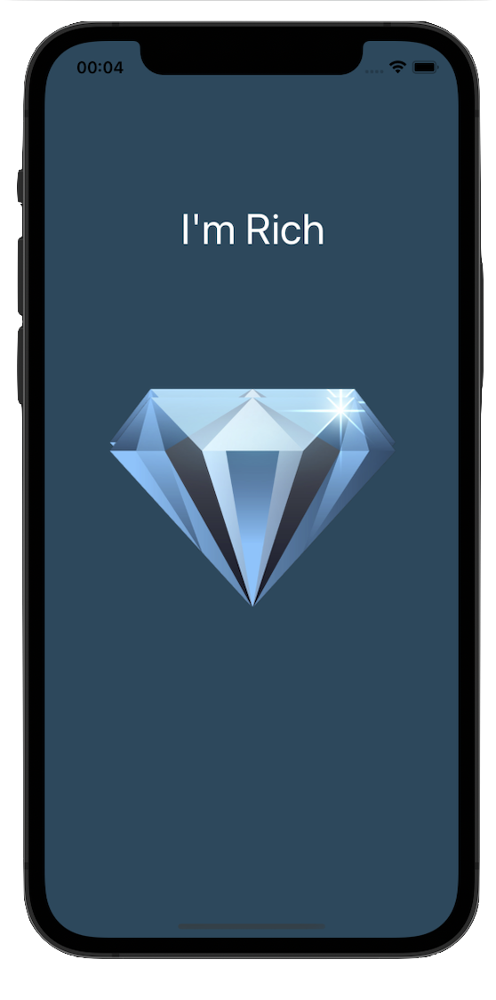
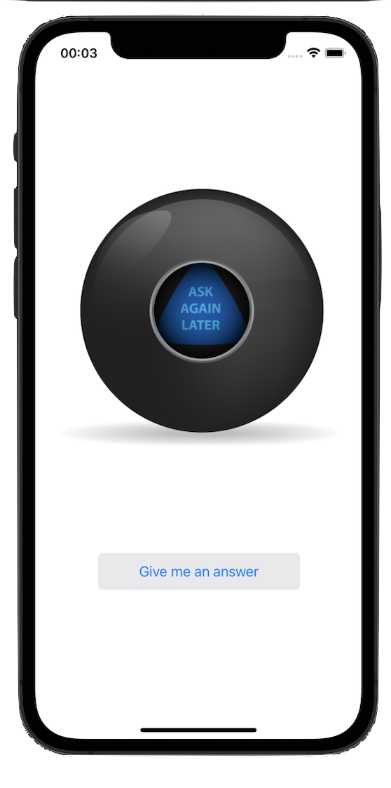
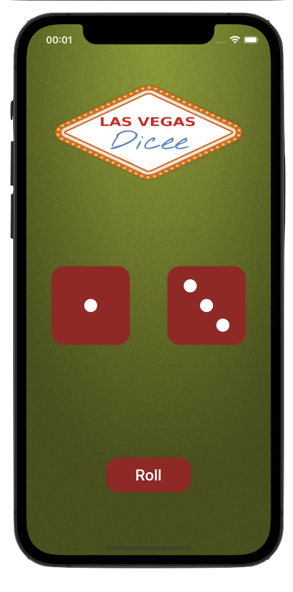
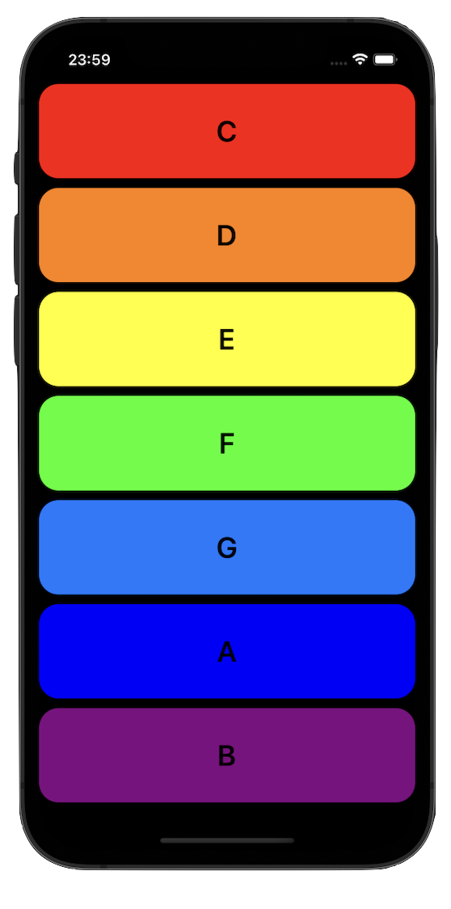
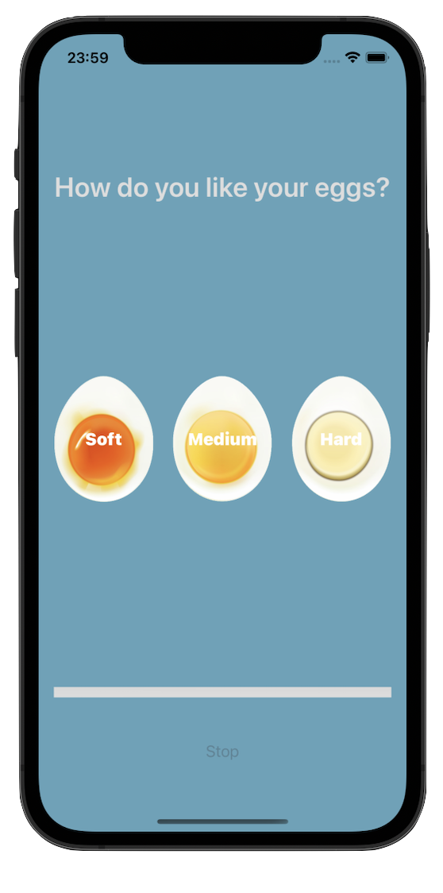
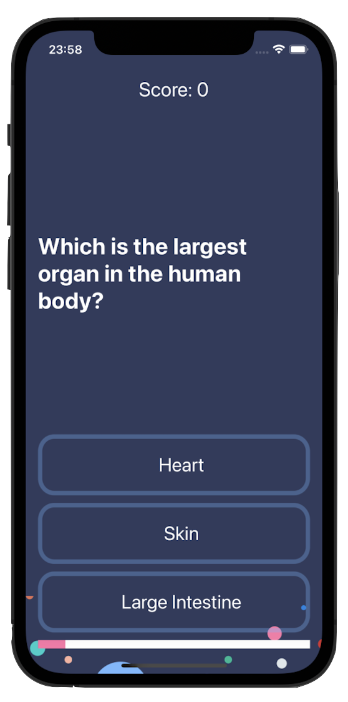

# Swift Marathon X

## This repository is a collection of projectors made during the Angela Yu - iOS Development Bootcamp course at the Swift marathon.

## Frameworks
- [x] UIKit
- [x] AVFoundation

## Technologies
- [x] Storyboards
- [x] UI in code
- [x] Async/await
- [x] Timer
- [x] Player 

## Screenshots
      

## Contact me
[LinkedIn](https://www.linkedin.com/in/nikita-semennikov-73a020253/ "https://www.linkedin.com/in/nikita-semennikov-73a020253/") | [Telegram](https://t.me/NikitaAndreevich10 "@NikitaAndreevich10") | [Email](mailto:semennikovna@yandex.ru "semennikovna@yandex.ru")
